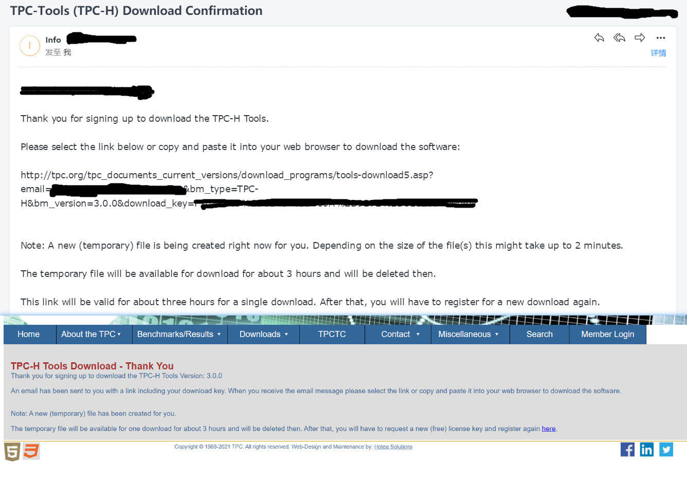
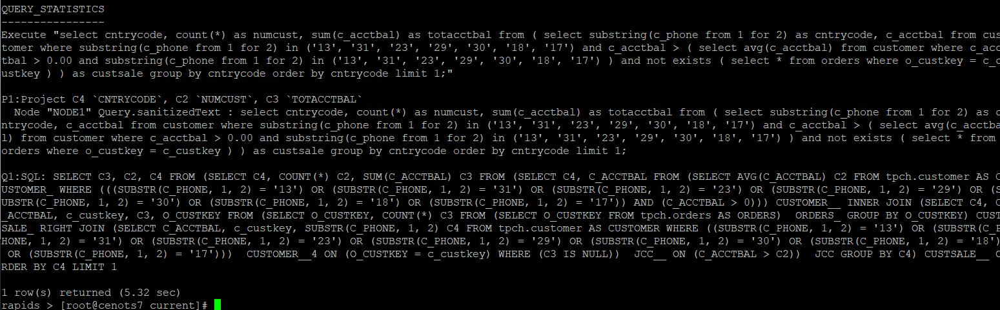

# TPC-H

TPC-H 是 TPC（Transaction Processing Performance Council）组织发布的一套数据库测试规范，同样的还有很多其他的规范，例如Hammer DB、BenchMarkSQL、Sysbench、YCSB等等一样，都是提供了一套标准，然后供市面上的相关产品来执行这套标准，根据测试结果，从侧面展示产品的性能。

从 [TPC 组织的官网](http://www.tpc.org/) 可以了解到，TCP 提供了一系列基准，据我了解，数据库基准测试大致可以分为两类：[OLTP](https://en.wikipedia.org/wiki/Online_transaction_processing)、[OLAP](https://en.wikipedia.org/wiki/Online_analytical_processing)。OLTP 类型中最流行的就是 TPC-C 测试基准，而 OLAP 中比较流行的则是TPC-H，而我们这次选择的就是TPC-H基准测试 。 

根据TPC-H的基准规范可以知道，TPC-H 将海量数据存储在8张表中，并运行 22 个查询（Q1~Q22）来分析这些数据。其主要评价指标是各个查询的响应时间，即从提交查询到结果返回所需时间，以及多个会话的吞吐量（每秒查询数量）。基准参考文档中介绍还介绍了，测试表与测试数据的详细信息，一些扩展数据以及执行规则等等，是一份详细的规则清单以及说明。可以手动的根据基准规范文档来创建数据表、生成数据、执行查询语句。也可以使用TPC-H工具包来生成相应的数据表与数据，然后依次测试这22个查询。

我看了一下网上的资料与公司服务器上的相关介绍，感觉都不是特别全面，因此准备从头开始使用新版的 TPC-H 3.0 进行数据库的测试，而接下来我便要在MemSQL上来测试 TPC-H 的相关基准。

-   需要预先安装好 MemSQL 或 MySQL。

-   `TPC-H_Tools_v3.0.0.zip`：通过邮箱申请的下载地址，只能使用一次，根据[下载教程获取文件](#TPC-H 工具包的获取)。

## TPC-H 工具包的 获取

1.  首先进入官网：http://tpc.org/
2.  进入工具包下载页面


3.  进入 TPC-H 下载页面


4.  填写相应信息与验证，获取下载地址。


5.  获取成功，从邮件中获取[下载地址](http://tpc.org/tpc_documents_current_versions/download_programs/tools-download5.asp?email=bufan.zhang@boraydata.com&bm_type=TPC-H&bm_version=3.0.0&download_key=F1078D69%2D3B4D%2D409A%2D9B72%2D6E32694D004D)




## TPC-H 工具包的 使用与介绍

查看工具包中的内容，了解 TPC-H 如何使用。

-   安装包解压后，会有附带的 `tpc-h_v3.0.0.docx` 与 `tpc-h_v3.0.0.pdf` 这里面介绍了，测试的相关标准，可以为手动测试提供参考。

-   `TPC-H_Tools_v3.0.0/dbgen`目录下的 `READEME`文件，介绍了工具相关用途。


感兴趣的 可以自己下载看看，我只介绍部分。


### 相关文件介绍

#### dss.ddl

该文件里面包含了 创建表的 8 条 SQL 语句。

#### dss.ri

这里是创建表约束的 SQL 语句，例如主键与外键。

#### /queries 文件夹

该文件夹下面是 22 条查询 SQL。

#### 上一层的 /ref_data 文件夹

该文件夹里面存放了，填充数据表所需要的数据。

#### dbgen 与 qgen

dbgen 是用来生成与填充 符合基准的数据表的程序，来帮助我们简单的构建符合要求的数据库。

qgen 是基于基准的查询程序，来帮助我们构建一个简单的基准实现。

以上两个可执行文件，均需要编译生成。


## TPC-H 工具包的 编译安装

### 提前准备

由于 我们下载的 TPC-H 是 `.zip` 格式，需要安装 `unzip` 来解压。 工具包内部代码基本是 `ANSI 'C'` 写的，并没有编译，因此我们需要手动编译安装，因此还需要 `gcc` 工具。

```sh
# 用来解压 zip 包的 unzip 命令
yum install unzip

# 用来 编译链接 的必备环境
yum install gcc
```


### 工具包的解压

工具安装好后，我们创建一个目录 并将下载的 工具包解压。

```sh
mkdir /usr/local/tpch
cd /usr/local/tpch
mv /usr/local/download/TPC-H_Tools_v3.0.0.zip ./
unzip TPC-H_Tools_v3.0.0.zip
```


### 修改部分文件

-   后续的 修改、编译、执行等操作都在 `TPC-H_Tools_v3.0.0/dbgen` 目录下完成

```sh
cd TPC-H_Tools_v3.0.0/dbgen
```

#### 修改 makefile 文件

该文件约束了 编译 后可执行文件的部分条件以及需要的依赖。

```sh
cp makefile.suite makefile
vi makefile
```

```sh
# 修改 103 109 110 111 这四行的内容


CC      = gcc
# Current values for DATABASE are: INFORMIX, DB2, TDAT (Teradata)
#                                  SQLSERVER, SYBASE, ORACLE, VECTORWISE
# Current values for MACHINE are:  ATT, DOS, HP, IBM, ICL, MVS, 
#                                  SGI, SUN, U2200, VMS, LINUX, WIN32 
# Current values for WORKLOAD are:  TPCH
# 这儿的 DATABASE 字段 指明了一些常用的商业数据库 如果写 MYSQL 需要在 tpcd.h 文件中添加部分宏定义
DATABASE= MYSQL
MACHINE = LINUX
WORKLOAD = TPCH
```

-   这儿有两个MySQL测试的示例 [修改为 sqlserver](https://sjp38.github.io/post/tpch-on-mariadb/) [修改为mysql](https://support.huaweicloud.com/tstg-kunpengdbs/kunpengtpch_02_0005.html)，还有一个PostgreSQL 的测试示例 [修改为PostgreSQL](http://xuzhenxue.cn/2018/07/28/PostgreSQL-TPCH/) ，对上面 DATABASE 内容修改，只要是 注释 中未指定的，都需要在下面的 `tpcd.h` 文件中添加宏定义，来确保正常编译。


#### 修改 tpcd.h 文件

如果上面把 **DATABASE** 设成了 **MYSQL** 的话就**不要跳过这一步**。上面那步也可以设成 **SQLSERVER** 这步就不用管了。上面提供的两个示例采用了不同的 修改方法，生成的文件 都能导入到 MYSQL，我也不太清楚 其中区别何在，可能只是 建表 建库时 的声明把，毕竟生成的文件都是符合SQL标准的。

```sh
vi tpcd.h
```

在头文件中添加如下信息

```sh
#ifdef MYSQL
#define GEN_QUERY_PLAN ""
#define START_TRAN "START TRANSACTION"
#define END_TRAN "COMMIT"
#define SET_OUTPUT ""
#define SET_ROWCOUNT "limit %d;\n"
#define SET_DBASE "use %s;\n"
#endif
```


### 编译

修改了上述文件后 ，我们直接在 `TPC-H_Tools_v3.0.0/dbgen` 目录下使用 `make` 命令，来生成可执行文件 `dbgen`。

```sh
make
```


## TPC-H 工具包 数据的生成与导入

### 生成 \<table>.tbl 数据文件

可以使用 `./dbgen -h` 命令查看，也可以查看 `README` 中对 `dbgen` 的相关介绍。


使用命令生成符合基准的8张表，与数据。更具介绍可知道 `-s` 后面是数据大小，若为 10 则生成 10GB 数据。

-V ：显示进度消息

-f ：覆盖原始数据

-s ： 生成数据的总体规模

```sh
# 生成数据
./dbgen -vf -s 1

# 查看生成的数据
ls *.tbl
```


### 导入数据

由于在Linux下，MemSQL 的表名、库名。等都是严格区分大小写的，而 `dss.ddl`（建表脚本）与 `dss.ri`（表约束脚本）中使用的都是**大写的数据库名与表名**，但是 22 条查询语句又使用的**小写的表名**，这儿为了不影响测试，我**统一转换为小写的库名与表名**。

#### 修改 dss.ddl

由于生成的 tbl 只是相关的源数据文件，还没有导到数据库中。我们利用工具包自带的建表脚本来创建相关的数据表。

```sh
vi dss.ddl
```

```sql
# 在最上面加上 我们的建库语句。

DROP DATABASE IF EXISTS tpch;
CREATE DATABASE tpch;
USE tpch;

# 在命令行模式下 在 ':' 后面输入如下命令 使创建的表名为小写 
%s/TABLE\(.*\)/TABLE\L\1
```


#### 修改 dss.ri

这里是创建索引的语句，后来发现这一步到后面运行有问题，因此可以跳过，[参考](#创建 表约束)。

```sh
vi dss.ri
```

```sh
# 修改第 4 行
USE tpch;

# 由于 该文件中 创建的约束 默认的数据库为 TPCD 我们上一步修改 dss.dll 也可以生成 TPCD 数据库，然后这儿仅需要修改第四行即可   
# 进入vi 命令行 在 ':' 后面输入如下命令  表示 从文件开始到结束 将所有 TPCD 替换为 tpch
%S/TPCD/tpch/g
# 将所有表名转换为 小写
%s/\(tpch\.\w*\)/\L\0
```


#### 生成数据表

进入 MemSQL 命令行，利用我们修改的 `dss.dll` 来创建数据表。

```sql
# 进入 MemSQL 由于我配置环境变量  并且默认 root 用户 没有设置密码
mymsql
# 运行如下命令 创建 相关的表
\. /usr/local/tpch/TPC-H_Tools_v3.0.0/dbgen/dss.ddl
```


#### 创建 表约束

依然在 MemSQL 中，执行如下命令。

~~\\. /usr/local/tpch/TPC-H_Tools_v3.0.0/dbgen/dss.ri~~

我安装的 MemSQL 版本是 `7.3.15`，我发现这一路进行到这一步，修改了很多遍，看了很多官方的介绍，都还是有些许问题。后来了解到，大多数 MySQL 存储引擎都是使用 B-tree 来存储索引的，而 MemSQL 是使用单向无锁的 skip 列表或者无锁的哈希表。这也就导致了无法实际的对存储的字段进行严格的约束。相关资料可以参考这两个地方 [官方介绍](https://docs.singlestore.com/db/v7.3/en/create-your-database/physical-database-schema-design/procedures-for-physical-database-schema-design/specifying-unenforced-unique-constraints.html) 与 [相关问题开发人员的回复](https://www.singlestore.com/forum/t/creating-primary-key-constraint-in-memsql-on-columnstore-tables/1751/2)。难怪我看网上也很少建完表后创建相关约束的，因此我在还没找到正确的解决方法前，也跳过这一步，直接开始进行数据的导入。

#### 导入数据

在导入数据前，我们可以打开 一个比较小的 tbl 文件看看，可以发现每个数据之间是用 `|` 来分隔   每行数据使用 `|\n` 来分隔，因此在导入数据时，我们需要将其格式化。创建一个 Shell 脚本来生成导入数据的 SQL。

```sh
vi local.sh
```

```sh
#!/bin/bash

write_to_file()
{
file="loaddata.sql"

if [ ! -f "$file" ] ; then
touch "$file"
fi

# 这儿是使用的数据库
echo 'USE tpch;' >> $file
echo 'SET FOREIGN_KEY_CHECKS=0;' >> $file

DIR=`pwd`
for tbl in `ls *.tbl`; do
table=$(echo "${tbl%.*}")
echo "LOAD DATA INFILE '$DIR/$tbl' INTO TABLE $table" >> $file
# 也可以 在外面 使用   sed -i 's/|$//g' *.tbl   命令来去掉每行末尾的 | ，那这儿就不需要 LINES 后面的内容了。
echo "FIELDS TERMINATED BY '|' LINES TERMINATED BY '|\n';" >> $file
done
echo 'SET FOREIGN_KEY_CHECKS=1;' >> $file
}

write_to_file
```

脚本创建完毕后，运行生成 SQL 文件，并交给 MemSQL 来导入数据。

```sh
# 生成 SQL 脚本，会在当前目录生成 loaddata.sql 文件。
sh load.sh

# 执行 SQL 脚本 ，执行前我们也可以打开看看。
memsql < loaddata.sql
```


### 查看数据

进入 MemSQL 查看一下数据有没有正常导入，查看数据库中数据量最小的表 nation 。

```sql
use tpch;
select * from nation;
```

可以看到导入其中的数据：


### 生成查询语句 与 修改

前面介绍了 DBGEN ，是用来生成表与数据的，现在来介绍 QGEN ，这也是编译后生成的可执行文件，主要是用来生成查询 SQL 语句的，同样的，和dbgen一样，可以再README中查看该命令的介绍。

```sh
# 创建一个生成 SQL 语句的目录
mkdir /usr/local/tpch/TPC-H_Tools_v3.0.0/saveSql
# 进入我们的 dbgen 目录，准备相关文件
cd /usr/local/tpch/TPC-H_Tools_v3.0.0/dbgen
# 拷贝 dists.dss (SQL语句格式化参考) 与 qgen (生成SQL的可执行文件) 到官方提供的 queries (22条未格式化的SQL语句) 目录
cp dists.dss qgen queries/
cd queries/
# 使用命令行来生成 SQL 语句并存放入我们创建的文件夹
for i in {1..22}; do ./qgen -d $i > ../../saveSql/$i.sql; done
# 进入 文件夹 查看生成的 SQL 语句
cd ../../saveSql
ll
```

可以看到现在已经有了 22 个SQL脚本，分别存放的是 22 条测试语句，但是这些测试语句还不能直接使用，需要做些许修改，才能再 MemSQL 中运行。


去除掉这些 SQL 中倒数第二行的分号

```sh
for i in {1..22}; do sed -i "/^`tail -n2 $i.sql|head -n1`$/s/;//" $i.sql; done

```

修改一些变量内容

```sh
# 将所有 limit -1 替换为 limit 1
sed -i '$s/limit -1/limit 1/' *.sql
# 去掉脚本中的 date 函数
sed -i 's/ date / /g' *.sql
```

然后我们手动修改一下 `1.sql` 、 `13.sql` 、`15.sql` 文件

```sh
################################# 1.sql ###########################
# 将 where 条件的内容修改 
# where
# 	 l_shipdate <= date '1998-12-01' - interval '90' day (3)

# 修改为 如下
where
	l_shipdate <= '1998-12-01' - interval '90' day
	
################################# 13.sql ##########################
# 加上字段别名 
#from
#	(
#		select
#			c_custkey,
#			count(o_orderkey)
from
	(
		select
			c_custkey,
			count(o_orderkey) as c_count
# 去除掉 表别名
#			c_custkey
#	) as c_orders (c_custkey, c_count)
#group by
#	c_count
			c_custkey
	) as c_orders
group by
	c_count
################################ 15.sql ############################
# 以下是修改后的文件
use tpch; 
with revenue0 (supplier_no, total_revenue) as
	(select
		l_suppkey,
		sum(l_extendedprice * (1 - l_discount))
	from
		lineitem
	where
		l_shipdate >= '1996-01-01'
		and l_shipdate < '1996-01-01' + interval '3' month
	group by
		l_suppkey)


select
	s_suppkey,
	s_name,
	s_address,
	s_phone,
	total_revenue
from
	supplier,
	revenue0
where
	s_suppkey = supplier_no
	and total_revenue = (
		select
			max(total_revenue)
		from
			revenue0
	)
order by
	s_suppkey;
```

接下来整个 SQL 就修改完成了，可以进入下面的测试环节了。


## 进行 TPC-H 基准测试

### 在 MemSQL 中进行测试

首先使用命令进行统一的修改。为每条 SQL 语句指名使用的数据库。

```sh
# 在个 SQL 文件的第一行 添加 use tpch; 的语句。
sed -i '1a use tpch; \n' *.sql
```

可以运行以下命令，查看在MemSQL中的测试结果了。

```sh
for i in {1..22}; do memsql < $i.sql; done
```


### 在 RapidsDB 中进行测试

由于我们主要是用来给 RapidsDB 进行测试的，我们现在登陆RapidsDB，来连上我们的MemSQL，开始测试。

修改一下我们的语句 在第一行添加 `stats` 关键字，这样在 RapidsDB Shell 中便可以显示语句的执行时间。

```sh
# 在个 SQL 文件的第一行 添加 use tpch; 的语句。
sed -i '1a stats \n' *.sql
```

进入我们RapidsDB的主节点，我这儿是 **192.168.30.200**，下面一系列的命令都是在主节点上完成。

```sh
# 进入 RapidsDB 目录 
cd /usr/local/rapidsDB/current
# 查看当前集群工作情况
./bootstrapper.sh -a healthcheck
# 如果各个节点都正常，那我们使用 Shell 接入  用户名/密码   rapids/rapids
./rapids-shell.sh
# 查看 当前有那些连接器
SHOW CONNECTORS;
# 创建 我们的 MemSQL 链接器，这儿指定连接的数据库 就是我们 TPC-H 测试数据的数据库
CREATE CONNECTOR MEMSQL1 TYPE MEMSQL WITH host='192.168.30.124',port='3306',user='root',database='tpch' NODE NODE1;
# 刷新连接器
refresh;
```

添加成功后我们再次查看连接器信息：


连接器添加成功后，我们在 Rapids 中使用该连接器，并查询一些数据，看看能否正常工作。

```sh
# 使用刚刚创建的连接器
USE CONNECTOR MEMSQL1;
# 查询同样的表
select * from nation;
```

这儿就不展示相关信息了，我们在 RapdisDB 上连接了我们的 MemSQL 后，退出我们的 RapidsDB，接下来使用 拷贝我们的 SQL 文件到主节点上进行测试。

```sh
# 使用 SCP 来远程的 复制 22条修改后的SQL 语句进行测试。
scp -r root@192.168.30.124:/usr/local/tpch/TPC-H_Tools_v3.0.0/saveSql /usr/local/download/TPC-H-SQL
# 然后进入我们的 Rapdis Shell 目录
cd /usr/local/rapidsDB/current
# 设置 shell 连接 Rapids 登陆的用户名 和 密码
export RDP_USERNAME=rapids
export RDP_PASSWORD=rapids
# 一次性测试所有的 语句
for i in {1..22}; do ./rapids-shell.sh < /usr/local/download/TPC-H-SQL/$i.sql; done
```

由于 22 条测试语句输出内容过多，这儿只截了部分仅供参考。



到此为止，TPC-H 完整的测试算是完成了。
